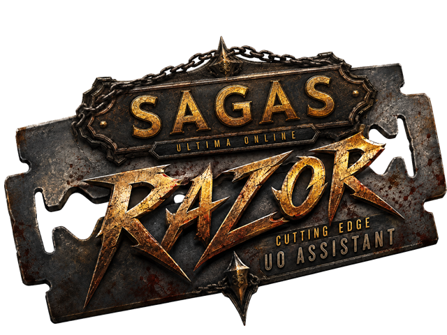

<p align="center">
  
</p>

<h1 align="center">UOSagas Razor</h1>

<p align="center">
  <a href="LICENSE"></a>
  
  
  
  
</p>

<p align="center">
  A modern, cross-platform Ultima Online assistant for the
  <b>UOSagas</b> freeshard — a ground-up port of the classic
  <a href="https://github.com/markdwags/Razor">Razor Community Edition</a> to .NET 8 and Avalonia,
  with a full scripting IDE, a Lua engine and a visual node-based script editor.
</p>

---

## What is this?

UOSagas Razor is the official assistant for the UOSagas shard. Unlike classic Razor, it does not
sit inside the game process as a Win32 plugin — it is a standalone .NET application that hosts the
UOSagas game client as a native library and talks to it through a versioned function-table ABI
(see [`external/AssistantApi`](external/AssistantApi)). That makes it fully cross-platform and
keeps the assistant honest: **every game action goes through the client, and the shard decides
what is allowed.**

It keeps the look, feel and file formats of Razor CE: if you have used Razor before, you will feel
at home immediately, and your existing `Profiles/*.xml` and `Macros/*.macro` files just work.

## Features

### Classic Razor, modernized
- The familiar tab layout: **General, Options, Display/Counters, Arm/Dress, Agents, Hot Keys,
  Macros, Scripts, Lua, VScripts, About**
- Agents (Buy, Sell, Organizer, Restock, Scavenger, Undress, Ignore, …), counters, overhead
  messages, bandage timer, dress lists, hotkeys — ported 1:1 from Razor CE
- Profile compatibility with Razor CE (`Profiles/*.xml`, `Macros/*.macro`)
- Crash reporter with opt-in log submission

### Macros
- Recording and playback exactly like Razor CE, including **Record from here** and
  **Play from here**
- Full right-click context menu on the action list: move, copy/paste, remove (with confirmation),
  insert special constructs (waits, pauses, comments, overhead messages, If/Else/EndIf,
  For/EndFor, While/EndWhile, Do/DoWhile) and double-click editing of existing actions
- Macro variables with in-game targeting (absolute target, double-click target, re-target)

### Razor scripting
- The complete Razor script language — **92 commands, 63 expressions**, a superset of Razor CE
  with UO Outlands extensions
- A real IDE: syntax highlighting, autocomplete, script console, error markers, breakpoints
- Script variables bound to in-game targets

### Lua
- A sandboxed Lua engine (LuaCSharp) with a rich API: player, items, mobiles, gumps, journal,
  targeting, spells, skills, messages — plus a **script UI API** (build your own windows with
  buttons, sliders, live bindings) and a **config API** for persistent script settings
- Same editor IDE as Razor scripts, with Lua-aware highlighting and completion

### VScripts (visual scripting)
- A blueprint-style **node editor** with 190+ nodes: execution trail, breakpoints,
  drag-off palette, comment boxes, undo/redo, functions
- Graph files are 1:1 compatible with the in-client VScript editor — share scripts freely

### Documentation & script library
- Full scripting documentation and a community script library live at
  **[share.uosagas.com](https://share.uosagas.com)**

## Screenshots

<!-- TODO: add screenshots (main window, macro context menu, script IDE, VScript editor) -->
*Coming soon — see [share.uosagas.com](https://share.uosagas.com) for a tour of the scripting tools.*

## Getting started

### Players

You don't need anything from this repository. Install UOSagas via the official launcher —
Razor is bundled, kept up to date automatically, and can be toggled in the launcher.

### Developers

Requirements:
- **.NET SDK 9.0.200 or newer** (the solution uses the `.slnx` format; the projects themselves
  target `net8.0`)

```
git clone https://github.com/uosagas/razor.git
cd razor
dotnet build
dotnet test
```

The test suite (300 tests) must stay green. Individual projects can also be built directly, e.g.
`dotnet build src/Razor.Avalonia`.

`src/Razor.Cli` (razorctl) is a minimal headless host for testing the ABI — it loads the native
client library, logs all callbacks and exposes the client services on a console:

```
dotnet run --project src/Razor.Cli -- --lib <path-to-native-client-lib> [client args...]
```

## ⚠ Development builds and the live servers

Please read this before you start hacking:

- **Custom builds only work on the UOSagas test server.** The production server only accepts the
  latest officially deployed, signed release — a version and signature gate on the server rejects
  everything else.
- Contributions therefore become playable on production **only after they are merged into `main`
  and deployed by the UOSagas team** through the official release pipeline.
- This is by design: it keeps the playing field level and lets us review every change that touches
  the live shard.

See [CONTRIBUTING.md](CONTRIBUTING.md) for the full workflow.

## Project layout

| Path | What it is |
|---|---|
| `src/Razor.Core` | UI-free core: world model, agents, macros, script engines (Razor/Lua/VScript), network mirror |
| `src/Razor.Avalonia` | The Avalonia UI (tabs, IDE editor, VScript node editor, dialogs) |
| `src/Razor.Plugin` | The plugin entry point loaded by the UOSagas client bootstrap |
| `src/Razor.Cli` | Headless host (razorctl) for ABI testing |
| `external/AssistantApi` | Synced copy of the client's plugin ABI (see its [README](external/AssistantApi/README.md)) |
| `tests/Razor.Core.Tests` | xUnit test suite (300 tests, incl. headless UI tests) |
| `tools/` | Doc generators for [share.uosagas.com](https://share.uosagas.com) |

## Credits

UOSagas Razor stands on the shoulders of giants:

- **[Razor](https://github.com/markdwags/Razor)** — Copyright (c) 2022 the Razor Development
  Community. Large parts of `Razor.Core` (agents, macros, world model, script engine) are ported
  from Razor CE, and the UI deliberately mirrors its layout. Thank you for two decades of Razor.
- **[ClassicUO](https://github.com/ClassicUO/ClassicUO)** — the client the UOSagas client is built
  upon, and the origin of the plugin-API idea this project's ABI evolved from.
- **[razorce.com](https://www.razorce.com/guide/)** and the
  **[UO Outlands wiki](https://wiki.uooutlands.com)** — reference material for parts of the
  scripting documentation.
- **[AvaloniaUI](https://avaloniaui.net/)**, **[AvaloniaEdit](https://github.com/AvaloniaUI/AvaloniaEdit)**
  and **[LuaCSharp](https://github.com/nuskey8/Lua-CSharp)** — the libraries that make the UI and
  scripting tick.

## License

This project is licensed under the **GNU General Public License v3.0** — see [LICENSE](LICENSE).

It incorporates code derived from [Razor CE](https://github.com/markdwags/Razor) (GPL-3.0);
original copyright notices are preserved in the source files.

## Links

- 📚 [share.uosagas.com](https://share.uosagas.com) — scripting documentation & script library
- 📖 [Project wiki](https://github.com/uosagas/razor/wiki) — features, building, FAQ
- 🤝 [CONTRIBUTING.md](CONTRIBUTING.md) — how to contribute
